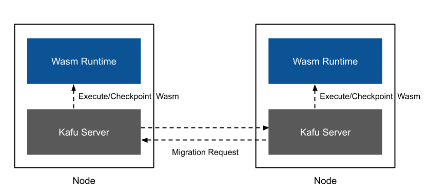

# System Architecture

This document describes the architecture of Kafu Server (invoked via `kafu serve`), the core component that executes WebAssembly modules in a distributed Kafu cluster.

## Overview

Kafu Server is a gRPC server that executes WebAssembly modules in a distributed cluster. It loads WebAssembly binaries from configuration files and manages runtime migration between nodes based on attributes embedded in the WebAssembly module.

## Core Components

### gRPC Server

Kafu Server runs as a gRPC server that handles migration requests between nodes. Each node in the cluster communicates via gRPC to transfer execution state.

### WebAssembly Runtime

Kafu Server loads and executes WebAssembly binaries using the Kafu runtime (built on Wasmtime). The runtime parses metadata embedded in the module to identify migration points and destination nodes.

### Kafu Attributes and Metadata

Kafu attributes are compile-time annotations that specify where functions should execute. During compilation, these attributes are encoded into WebAssembly custom sections as metadata. At runtime, Kafu Server reads these custom sections to identify migration points and destination nodes.

## Checkpoint Restore

Checkpoint Restore is the core mechanism that enables migration between nodes. It allows the runtime to capture (checkpoint) the full execution state on one node and restore it on another node to continue execution seamlessly.

This capability is made possible by [Snapify](snapify.md), a WebAssembly binary transformation tool that instruments the wasm module at compile time. Snapify inserts checkpoint/restore logic into the binary so that the runtime can suspend and resume execution at designated migration points.

### Checkpoint Restore Flow

When a function annotated for migration is called:

1. **Trap at migration point**: The function execution triggers a migration point inserted by [Snapify](snapify.md)
2. **Checkpoint state**: The runtime captures the current execution state:
   - Stack state (via Asyncify)
   - Global variables
   - Memory contents
3. **Send migration request**: The source node sends a gRPC request to the destination node with the checkpointed state
4. **Restore on destination**: The destination node restores the state and continues execution
